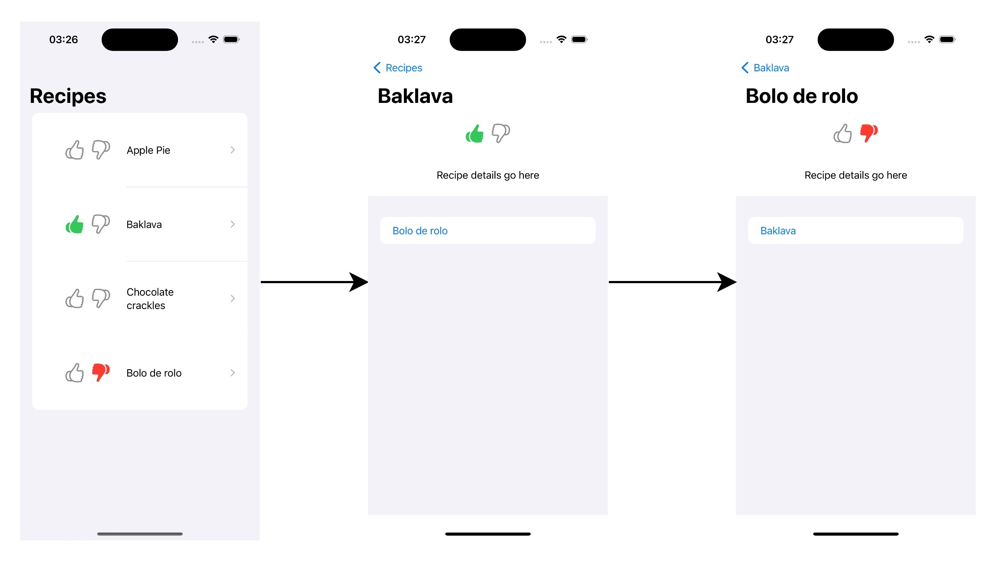
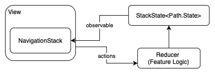
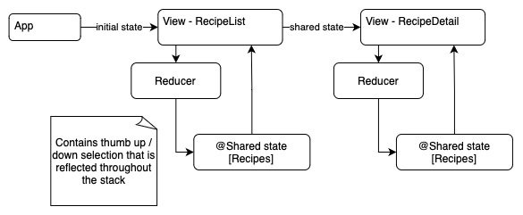

# About

A comparison between the super simple [Model View (MV)](https://azamsharp.com/2023/02/28/building-large-scale-apps-swiftui.html) architecture and the more complex and opinionated [The Composable Architecture (TCA)](https://pointfreeco.github.io/swift-composable-architecture/main/documentation/composablearchitecture) when performing AI-Assisted Coding to build a small SwiftUI iOS App.

# Summary of Findings

| Architecture        | [Model View](https://azamsharp.com/2023/02/28/building-large-scale-apps-swiftui.html) (MV)                                                | [The Composable Architecture](https://pointfreeco.github.io/swift-composable-architecture/main/documentation/composablearchitecture) (TCA)                                                   |
| ------------------- | -------------------------------------------------------------- | ----------------------------------------------------------------------------- |
| Summary             |                                                           |                                                                          |
| Time taken          | 40                                                             | 80                                                                            |
| Errors while coding | 1                                                              | 3                                                                             |
| Errors fixed by AI  | 1                                                              | 3                                                                             |
| Navigation          | ⚠️ Used NavigationView instead of NavigationStack (old syntax) | ⚠️ Needed prompting to use NavigationStack instead of a List                  |
| State Management    | ✅ as expected                                                  | ⚠️ Did not used Shared State, but the solution developed was still functional |
| Views               | ✅ as expected                                                  | ⚠️ Initially used old TCA syntax like 'WithViewStore', and not using macros   |

## Key Takeaways

* The AI Tool used in this test ([Cursor](https://www.cursor.com)) reached the solution faster and made less mistakes implementing the simpler Model View (MV) architecture than when implementing TCA.
  * (However I still believe...) Your choice of architecture should primarily be driven by what you believe is the right architecture for maintaining the software you are building, and not by the AI tool you're using. Both a flexible and simple architecture like MV, and a more opinionated and complex architecture like TCA **can be built with an AI assistant**. However, your ability to maintain the code going forward is still an important feature of your architecture, so if you believe the more complex structure will benefit you as the code evolves, you should still use that approach.
* The quality of code is more determined by the *knowledge you have acquired to direct* the AI towards a good solution. Don't expect the combination of the right architecture + AI to mean you don't have to think through and research the best way to structure your solution.
* Having the LLM tightly integrated into the IDE like it is in [Cursor](https://www.cursor.com) significantly improves the flow of building and iterating with an AI
* The different syntax for old vs new versions of TCA caused the biggest misunderstanding from the AI in this test. The code was written 1st using the old TCA syntax, and without knowledge of the different versions of TCA, I wouldn't have known to ask the AI to update to the new syntax.
* If you are using a more complex architecture pattern like TCA (complex meaning; has multiple published versions online, integrates with dependencies, uses non vanilla Swift constructs), and you are unfamiliar with the architecture that you are trying to implement, then you shouldn't rely on your LLM assistant to replace you having to put in effort reading and learning. Unless you know the right questions to ask, and are able to provide the right prompt to move the solution towards latest best practice, the result could be out of date, or broken.

# Feature Implementation Test

To compare architecture patterns I have described a simple feature set that can be contained within less than 5 files. I have chosen 2 app features to allow the architecture patterns to expand into their different structures; navigation and shared state.

# Architectures

## The Composable Architecture (TCA)

The Composable Architecture (TCA) is a *strongly opinionated* Swift framework for building modular, testable, and predictable state management in iOS applications using a unidirectional data flow, combining state, actions, and side effects into a single cohesive structure.

TCA single view structure showing Unidirectional Data Flow (UDF)

TCA navigation using NavigationStack (iOS 16+)

TCA Shared State

### Building the Features Using TCA Architecture

Result:

* Time taken to complete app: ~80 minutes
* Number of build errors during process: 3
  * build errors fixed by AI: 3

See the [Source Code and Prompts Used here](https://github.com/MBaldo83/LLM-SwiftUI-Architectures-Compared/tree/main/LLM%20Implementations/TCA%20Architecture/LLM%20TCA%20Receipes)

### References

* [TCA Documentation](https://pointfreeco.github.io/swift-composable-architecture/main/documentation/composablearchitecture)
* [TCA Stack Based Navigation](https://pointfreeco.github.io/swift-composable-architecture/main/documentation/composablearchitecture/stackbasednavigation)
* [TCA Sharing State](https://pointfreeco.github.io/swift-composable-architecture/main/documentation/composablearchitecture/sharingstate)

## Model-View (MV)

Model-View (MV) is a flexible and fairly *un-opinionated* architecture pattern for iOS Swift applications separates the app into two main components: the Model, which handles data and business logic, and the View, which manages the UI.

MV single view structure

MV navigation using NavigationStack (iOS 16+)

MV Shared State

### Building the Features Using MV Architecture

Result:

* Time taken to complete app: ~40 minutes
* Number of build errors during process: 1
  * build errors fixed by AI: 1

See the [Source Code and Prompts Used here](https://github.com/MBaldo83/LLM-SwiftUI-Architectures-Compared/tree/main/LLM%20Implementations/Model%20View%20Architecture/MV%20Receipes)

## Tools used (All Tests)

* Cursor AI Version: 0.41.2
  * LLM: claude-3.5-sonnet
* VSCode Version: 1.91.1
* Xcode 15.4
* iOS 17.5

## Workflow used (All Tests):
1. Generate key entities (View, Model)
2. Update Model Layer
3. Update View Layer

### MV References
* https://azamsharp.com/2022/10/06/practical-mv-pattern-crud.html
* https://azamsharp.com/2023/02/28/building-large-scale-apps-swiftui.html
* [Apple The SwiftUI cookbook for navigation](https://developer.apple.com/videos/play/wwdc2022/10054/)
