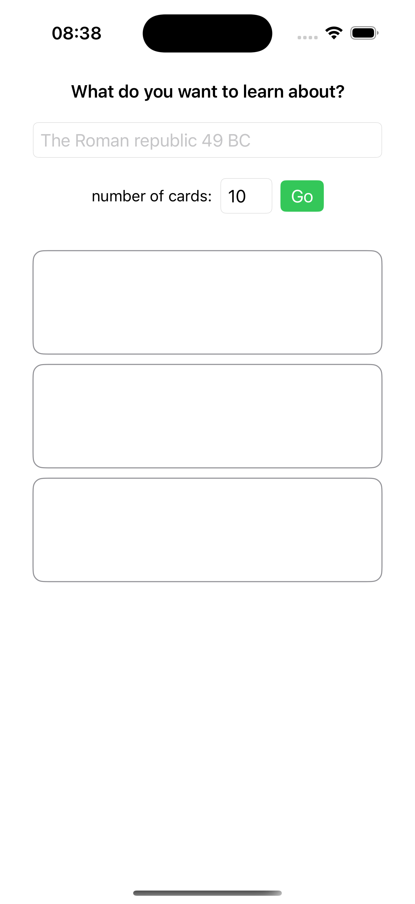
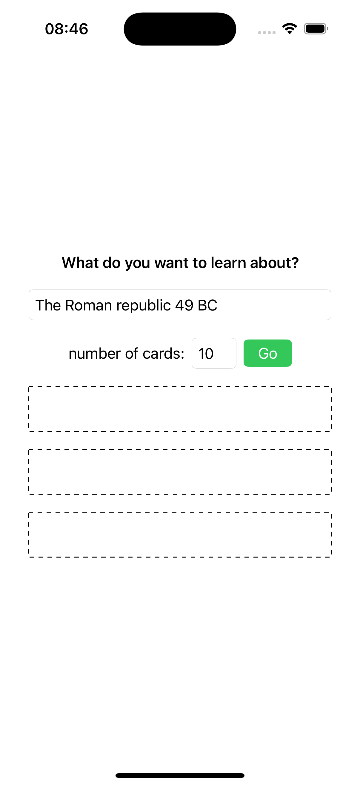
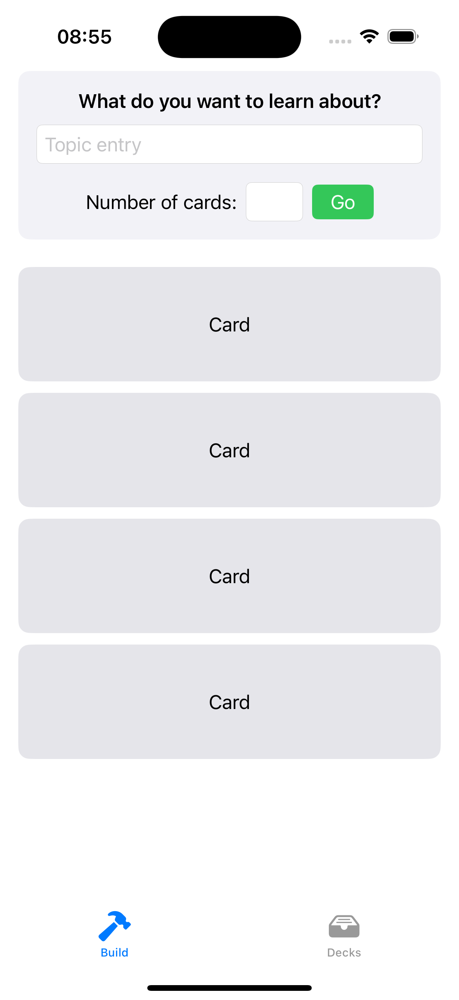
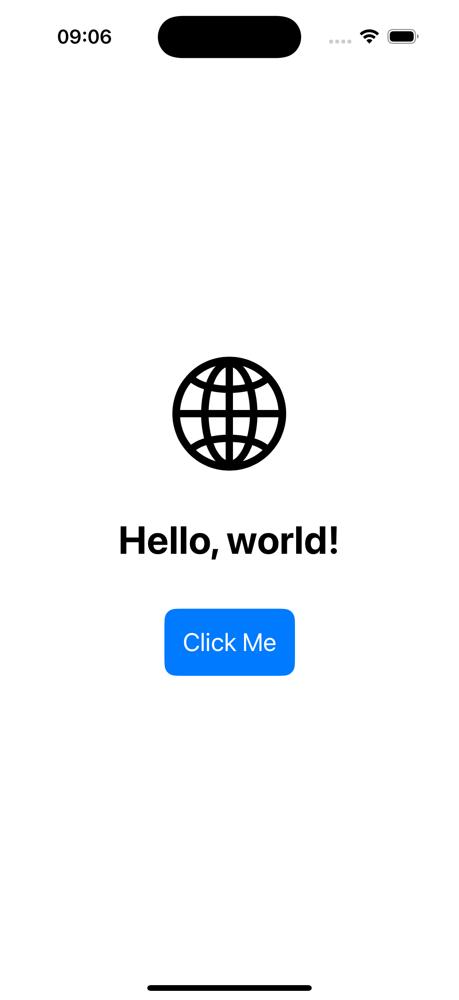
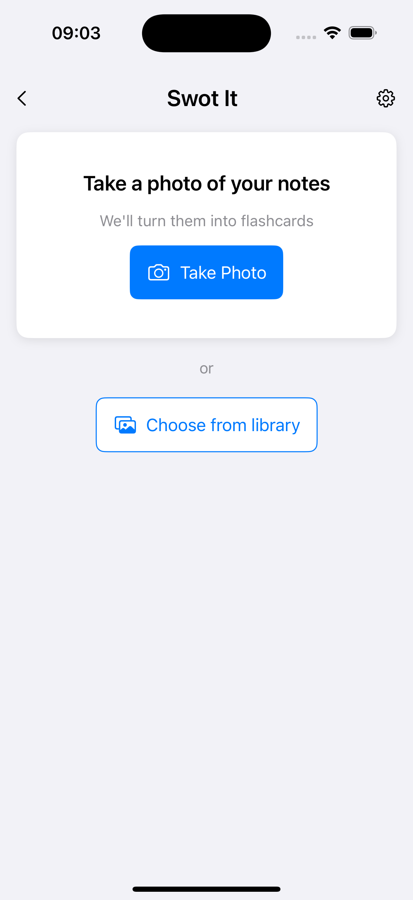
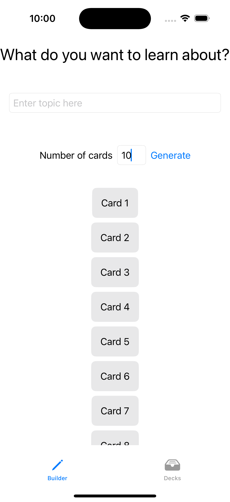
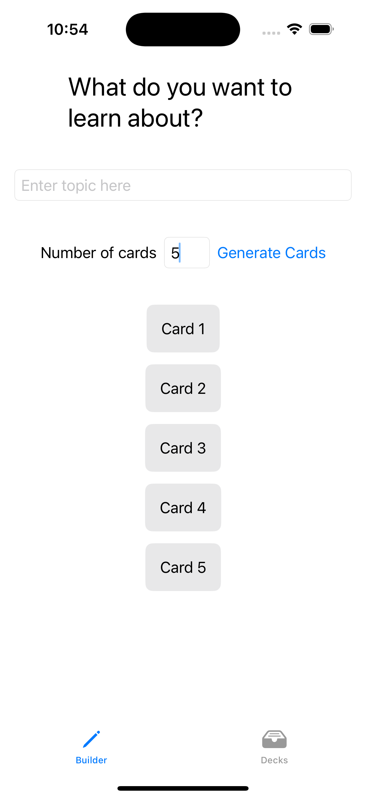

# About

In this post I explore different approaches when inferencing LLMs to write code: 
1. Using a png image as a prompt for SwiftUI code
2. Detailed initial prompt followed by refinements
3. Small iterative prompts building each view component piece by piece

# Summary of Findings

| Prompt Approach                  | Result                                                                                                                                                       |
| -------------------------------- | ------------------------------------------------------------------------------------------------------------------------------------------------------------ |
| 🏆 Detailed initial text prompt       | GPT-4o and Claude-Sonnet 3.5 both performed well with detailed prompts asking to write 30-50 lines of code output                                            |
| Multiple small text prompts           | The code output is good, and you have an iterative sense of how the feature is built, but this option becomes expensive and requires greater prior knowledge to direct the solution |
| Image with annotations           | Out of all the 'Image to Code' experiments this worked the best, annotations dramatically helped the solution                                               |
| Image without annotations        | Even for a simple UI design the result needed a lot of refinement                                                                                            |
| Reference link to Figma web page | This didn't work at all!                                                                                                                                      |

## Key Takeaways

* Using bigger and more detailed prompts (up to a point) is more cost effective if you're using a tool like Cursor where your usage quota is based on the number of requests. You get more bang for your buck if you take time to compose a detailed and clear prompt.
* There is a lot of value to be gained by querying the models about choices made in the code, E.G. "are there any other ways to display a scrolling list of cards in SwiftUI?" provided a good comparison between List and LazyVStack 
* Image to code works, and is not terrible, but not perfect either. Best of all with GPT-4o, but the code produced was unpredictable across different models, and needed more refinement afterwards

## Suggested Workflow

1. Start by writing clear detailed instructions about how you want your implementation to be built 
2. Take time to compose your initial prompt describing in detail the problem you are trying to solve, and if you are certain about entity types to be used include them
3. Refine the code produced by drilling into non-functional requirements (performance, security, flexibility etc), either through further prompting, or manually optimising the implementation towards the best approach
3. Review the approaches developed against trusted sources using links to references in the prompt (eg. Framework Documentation)

# Images and Designs to Code

| Methodology                                         | Design                     | Output                     |
| --------------------------------------------------- | -------------------------- | -------------------------- |
| Model: claude-sonnet-3.5 PNG Without Annotations |  |  |
| Model: GPT-4o PNG Without Annotations            |  |  |
| Model: claude-sonnet-3.5 PNG With Annotations    |  |  |
| 🏆 Model: GPT-4o PNG With Annotations               |  |  |
| Model: claude-sonnet-3.5 Figma Design URL        |  |  |
| Model: GPT-4o Figma Design URL                   |  |  |

Find the code produced for each example by looking at the [commit history here](https://github.com/MBaldo83/swot.it/tree/main/AI-Workflows-Testing/Swot-It-Image-To-SwiftUI)

# Asking And Refining

## Big Prompt

| Prompt                                 | Model             | Output                     |
| -------------------------------------- | ----------------- | -------------------------- |
| see [Big prompt with details](https://github.com/MBaldo83/swot.it/tree/main/AI-Workflows-Testing/Swot-It-Asking-And-Refining)            | claude-sonnet-3.5 |  |
| 🏆 see [Big prompt with details](https://github.com/MBaldo83/swot.it/tree/main/AI-Workflows-Testing/Swot-It-Asking-And-Refining)            | gpt-4o            |  |
| see [Small prompts creating iteratively](https://github.com/MBaldo83/swot.it/tree/main/AI-Workflows-Testing/Swot-It-Asking-And-Refining) | claude-sonnet-3.5 |  |
| see [Small prompts creating iteratively](https://github.com/MBaldo83/swot.it/tree/main/AI-Workflows-Testing/Swot-It-Asking-And-Refining) | gpt-4o            |  |

In all the workflows listed above, to get to a point where I was happy with the code required subsequent changes to refine the implementation such as using a LazyVStack vs VStack, or splitting the view into smaller pieces.

# Tools used

* Cursor AI Version: 0.41.2
  * LLM: claude-3.5-sonnet / gpt-4o
* VSCode Version: 1.91.1
* Xcode 16.0
* iOS 17.5
