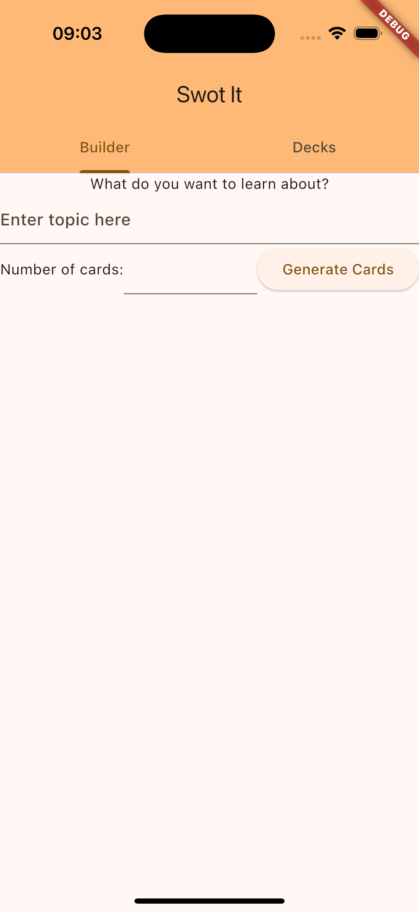
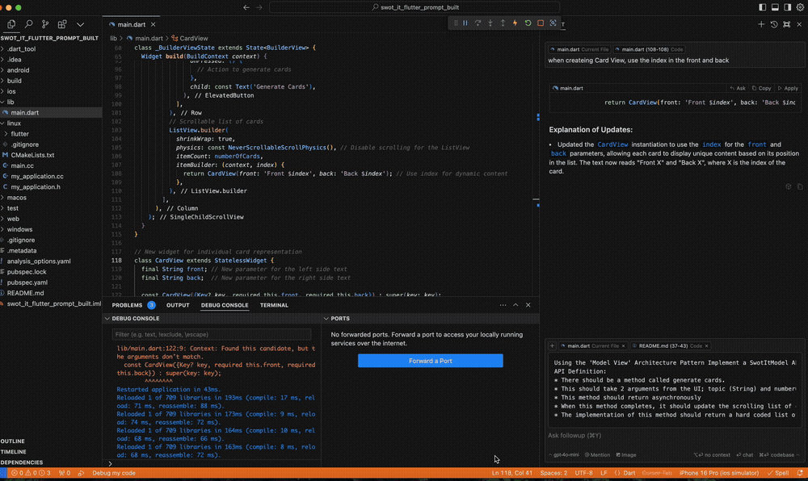
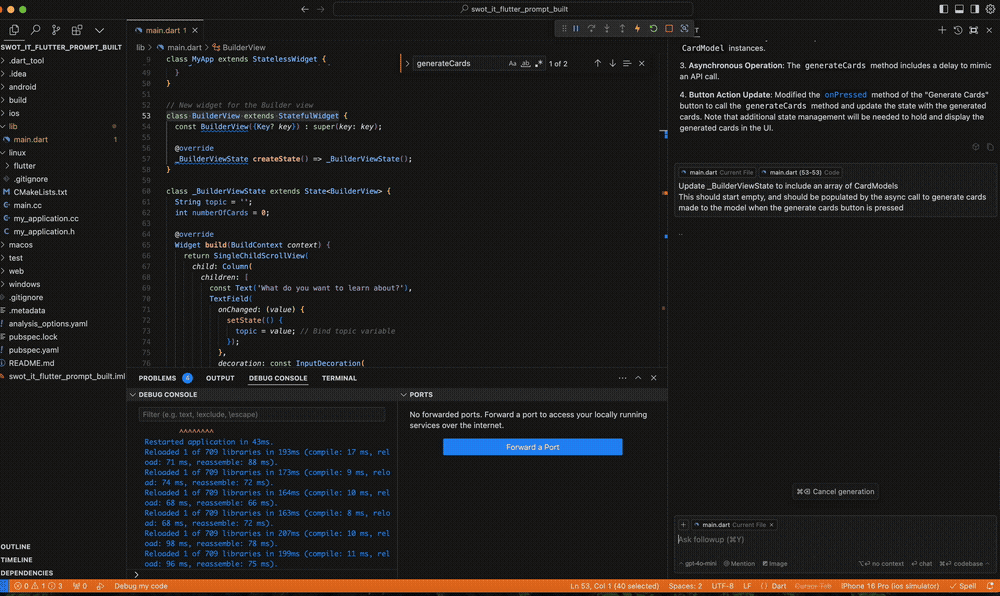

# About

I take a [similar set of prompts](https://github.com/MBaldo83/AI-Coding-Examples-Swot-It/blob/main/swot_it_flutter_prompt_built/README.md) used to build a Swift UI app, and use them to build a [Flutter app](https://docs.flutter.dev).
## Why?
* To explore how well the AI models cope with developing a Flutter app
* To explore a workflow for cross platform feature development by writing platform agnostic prompts before 'deploying' these to write code.

# Summary of Findings

| Question                                                                                                  | Result                                                                                                                                                                           |
| --------------------------------------------------------------------------------------------------------- | -------------------------------------------------------------------------------------------------------------------------------------------------------------------------------- |
| Can AI Assisted Coding be used for Flutter Apps?                                                          | 👍 Yes! The Flutter / Dart syntax is understood and can be generated by gpt-4o.<br>However, to ensure the code is maintainable you shouldn't rely on the AI generated output<br> |
| Can the same prompts be used to build different implementations of the same features eg (Swift & Flutter) | 🗺️ Yes, worth exploring but there are gotchas!                                                                                                                                                        |

## Key Takeaways

### What works well
I had to change very little to adapt a set of prompts used to build a small Swift UI app into prompts that successfully *built and ran* a Flutter app, which is in itself impressive.

As a developer using tools like Cursor + gpt-4o, if we are clear about *our* role vs the role of the *AI assistant*, we can use these tools very effectively as a *mechanism to speed up the process of writing code* according to a well thought through design that *we have designed*.

### What to watch out for

To use AI tools in production to produce code that can be maintained, tested and fits within production standards requires expertise to implement properly. Shipping production code without taking time to consider the design patterns used by the LLMs will surely lead to problems down the line!

For example, these structural issues were introduced when running through the prompts:

1. The code produced is continuously added to the same file and you need to ask the tool to refactor elements out if you want to re-use them.
2. Repeated view layout constants like padding are added in multiple places
3. Plain old bugs were introduced like the re-construction of the entire Model structure each time a button is pressed removed all previously saved state

### Future Speculation!

Cross functional teams could definitely benefit from exploring coding with prompts and design patterns, which would then be used with AI tools to generate code. Over time I think this could reduce the importance of the underlying language and deployment target. This shift could lead to more efficient cross-functional development for iOS and Android, with a large portion of the 'work' focused on prompt creation and design structure, making actual code writing a less significant part of the process.

In this new workflow where the engineer works primarily on the level of converting requirements into software 'designs' through detailed prompts, cross-platform frameworks like Flutter become less useful. The effort required to produce multiple native builds diminishes when most of the effort is spent on prompts and design consistency.

# Building the App using Prompts

[List of prompts documented here](https://github.com/MBaldo83/AI-Coding-Examples-Swot-It/blob/main/swot_it_flutter_prompt_built/README.md)

| Prompt                      | Errors | Result | Demo |
| --------------------------- | ------ | ------ | ---- |
| View Scaffolding            | 0      |     |   |
| Scrolling List of Cards     | 0      | -    | -  |
| Model API to generate cards | 1<br>Error: Rebuilt CardView with new argument requirements and didn't update call site      | -    |   |
| Integrate Model with View   | 0      |     |   |

## Prompt to Code Output Analysis

### 1. View Scaffolding
<details>
<summary>Prompt Details</summary>
<div class="gatsby-highlight" data-language="text"><pre class="language-text"><code class="language-text">I need you to write Swift code for a SwiftUI feature using The I'd like to build a Flutter View with the following elements (top to bottom):
1. A title label with the text "What do you want to learn about?"
2. A text field (topic) with multiple lines to input with placeholder text "Enter topic here"
  - The value of this text (topic) should be bound to a variable that can be used when performing an action
3. A Horizontal Stack with text: "number of cards", an input box (numberOfCards) that accepts Integers only and a button to generate the cards
- The value of the numberOfCards input box should be bound to an integer variable that can be used when performing an action
4. A scroll view containing the list of cards that are generated

This view should be contained inside a Tab Bar with 2 tabs, "Builder" (this view) and "Decks" (an empty view)
Please ensure: 
1. That the Scrolling List View of cards is performant when rendering any number of cards on the screen
2. The View to represent a Card in the list is refactored so that it can be modified independently of the the containing List view
</code></pre></div>
</details>

#### Analysis

In one file, the view scaffolding is implemented and is functional, however there are some immediate issues I see with the code:
  * UI layout variables are hard-coded into the views and repeated. These will become hard to maintain over time unless the code is refactored into a single source of constants, or once the complexity becomes greater into a design library.

### 2. Scrolling List of Cards
<details>
<summary>Prompt Details</summary>
<div class="gatsby-highlight" data-language="text"><pre class="language-text"><code class="language-text">The UI to display a Card in the scrolling list view should be:
Card Dimensions height: 200, width: filling the screen with padding of 10
The card should be divided vertically down the centre with a dotted line 1 point wide
The Card should have 2 not-editable text fields one on the left of the dotted line and the other on the right of the dotted line filling the space with a padding of 10
To render a card you should provide 2 static strings, front (left side of card) and back (right side of card)
The card should have a subtle drop shadow
</code></pre></div>
</details>

#### Analysis
Again, the code is *functional*, however here we see more hard-coded values spread through the UI, and also some structural decisions have been made about the flexibility of the code. Look at the following code for BuilderView
```dart
class _BuilderViewState extends State<BuilderView> {
  //...

  @override
  Widget build(BuildContext context) {
    //...
    ListView.builder(
            //...
            itemBuilder: (context, index) {
              return CardView(
                front: generatedCards[index].front, // Use front from generated cards
                back: generatedCards[index].back, // Use back from generated cards
              );
            },
          ),
              //...
  }
}
```
The `CardView` is directly coupled to how we build `BuilderView`, eg we cant compile `BuilderView` without `CardView` having the interface it currently does. It is not the purpose of this article to make a strong opinion on whether this is *good* or *bad* practice, but what is clear is that the decision has been made. The consequence of this down the line might be that when you want to change how a `CardView` is constructed, you also need to update the `BuilderView` source. 

### 3. Model API To Generate Cards
<details>
<summary>Prompt Details</summary>
<div class="gatsby-highlight" data-language="text"><pre class="language-text"><code class="language-text">Using the 'Model View' Architecture Pattern Implement a SwotItModel API that the view can call to generate cards
API Definition:
* There should be a method called generate cards.
* This should take 2 arguments from the UI; topic (String) and numberOfCards (Int)
* This method should return asynchronously
* When this method completes, it should update the scrolling list of cards in the UI
* The implementation of this method should return a hard coded list of Card Models tha can be displayed by the View
</code></pre></div>
</details>

#### Analysis

This time I needed to make some changes for the code to even compile, but these were trivial, the CardView was updated with new argument requirements and didn't update call site.

Here we are asking for a hard-coded mocked behaviour, and that's exactly what we got! The implementation even included a simulated delay which is quite useful when building loading states:

```dart
Future<List<CardModel>> generateCards(String topic, int numberOfCards) async {
    // Simulate a delay for asynchronous operation
    await Future.delayed(const Duration(seconds: 1));

    // Hardcoded list of CardModels based on the number of cards requested
    return List.generate(numberOfCards, (index) {
      return CardModel(
        front: 'Front $index for $topic',
        back: 'Back $index for $topic',
      );
    });
  }
```

### 4. Integrate Model with View
<details>
<summary>Prompt Details</summary>
<div class="gatsby-highlight" data-language="text"><pre class="language-text"><code class="language-text">Update _BuilderViewState to include an array of CardModels 
This should start empty, and should be populated by the async call to generate cards made to the model when the generate cards button is pressed
</code></pre></div>
</details>

#### Analysis

A fundamental issue here is that the *construction* of the SwotItModel() is done inside the `onPressed` code block.

```dart
class _BuilderViewState extends State<BuilderView> {
  //...

  @override
  Widget build(BuildContext context) {
    //...
    ElevatedButton(
                onPressed: () async {
                  final model = SwotItModel();
                  final cards = await model.generateCards(topic, numberOfCards);
                  // Update the state to display the generated cards
                  setState(() {
                    generatedCards = cards; // Populate the array with generated cards
                  });
                },
                child: const Text('Generate Cards'),
              ),
              //...
  }
}
```

Not only is this tightly coupling Model behaviour to a view, but it is also very likely to be a bug further down the line, as any previous model state is erased each time we press the button!


# Tools used

* Cursor AI Version: 0.41.3
  * LLM: gpt-4o
* VSCode Version: 1.91.1
* Xcode 16.0
* iOS 18
