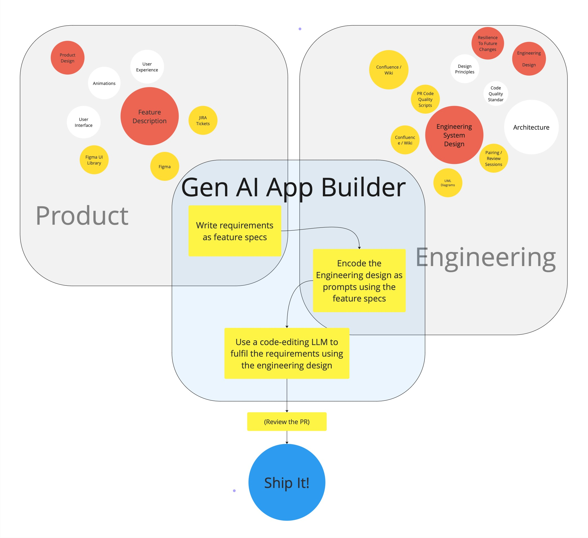
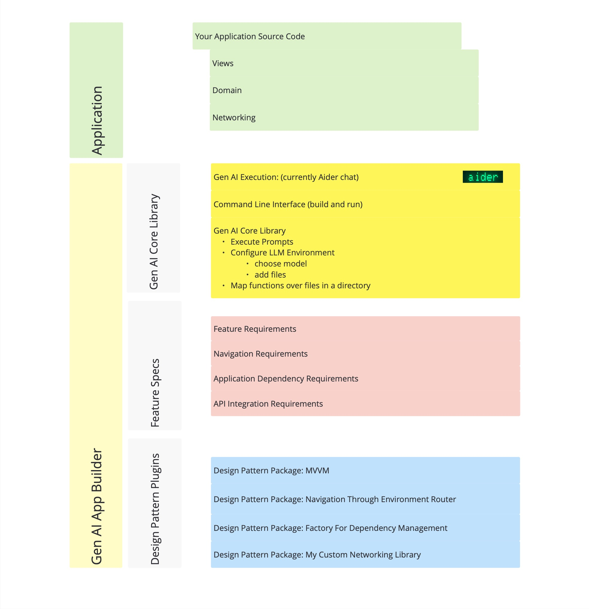
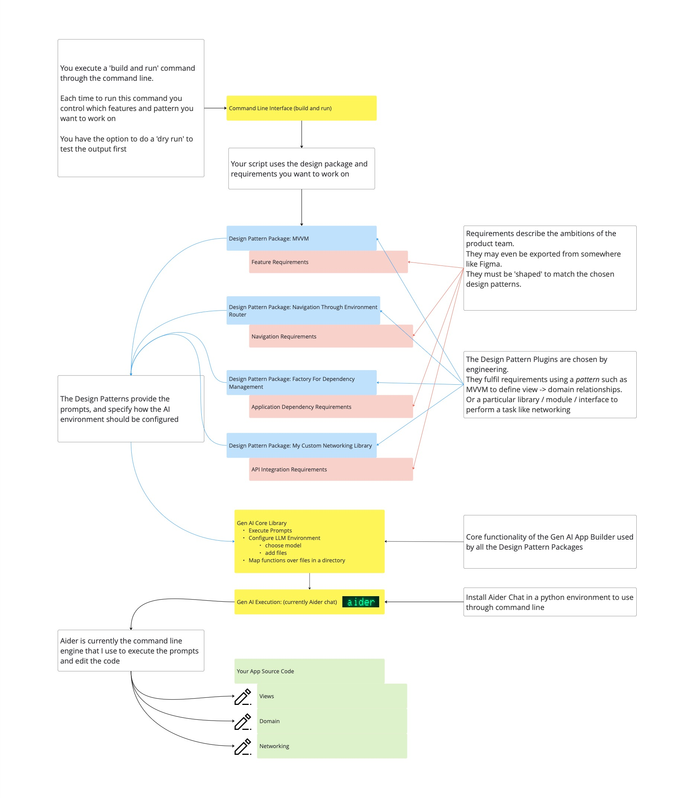

# About

This introduces an approach to writing software that uses generative AI tools to iteratively write the views, and navigational structure for a mobile app using a set of product requirements. Over time I hope this system can grow to accommodate more and more aspects of mobile app development.

Using this system, the prompts used by the AI to generate the source code are not written each time by the developer, but are saved in libraries that are pre-configured to code common problems using a particular pattern. For example you might choose to use a library that implements a set of views using the MVVM pattern or you could choose The Composable Architecture (TCA). Using this system the same requirements could be used to generate the underlying structure for either approach. 

This results in a new type of development environment where you write software by taking *feature specifications* encoding a description of your product requirements, and *prompt generators* that encode a chosen approach to how to implement those requirements.



# Talk is Cheap, Show me the Code

[Starter iOS MVVM Demo Project](https://github.com/MBaldo83/StarteriOSMVVM)

# But Why?

Before diving into *how* I've started building this sort of a system. I think it's worth expanding a little bit on *why* I think it could be useful.

## Big Picture: Imagine a world where...
* We write software by choosing the design pattern that best solves our problem and leave the implementation of this pattern up to the AI.
* We decide that MVVM was a bad choice for our app so we choose to move to The Composable Architecture TCA, and AI rewrites the entire project for us.
* We use AI agents to analyse our code for missing tests, security flaws, performance issues, and code that doesn't adhere to *our* standards.
* We include a new library to send analytics, the library comes with a set of prompt generators we can plug into our system, and they use an LLM to implement the library for us, using the best practices encoded by the authors as prompts.


## Now: More specifically....
* Generative AI has unrealised potential
  * Generative AI (gen-AI) for software development has developed rapidly over the past few years. It's changed the way many developers work on the *micro* level of writing code where it's already commonplace to write simple functions using gen-AI assistants. However, for big projects there's currently no way to scale this to the *macro* level and direct a gen-AI toolset to keep iterating and writing code in the way we want it to until a full set of features are fulfilled. The approach proposed here joins these simple tasks together to build a complete set of code from a set of feature requirements. This expands the time-saving potential for gen-AI coding assistants from helping to write individual functions to writing tens or hundreds of files that all work together as a set of source code to fulfil requirements.
* Generalising the approach to writing software leads to more familiar and resilient code structures
  * What this approach asks us to do is to define as a set of descriptive prompts describing *how* to implement requirements as code within a chosen pattern. Essentially this is already what 1000+ blog posts on MVVM or TCA or whatever network architecture you choose already do, and again (privately) what 1000s of teams do with 'coding principles' Wiki-pages. This tool uses these descriptions of how to write code in a way that actually allows you to automate the process of writing code. By encoding the knowledge and experience of many engineers into the system used to write the code, we can systematically improve the code produced, avoiding bugs and pitfalls that have been learnt through experience.
* If I give more responsibility to AI, I want to guide it
  * As software development teams increasingly incorporate gen-AI tools into their workflow, having a structure in place to ensure coding standards are maintained will set your team up for success as this new practice evolves. This research will help position development teams to be ready for that change.
* We save time by removing repetitive prompt writing.
  * Saving time by removing repetition is a very common aim in software development, it even has it's own acronym [DRY](https://en.wikipedia.org/wiki/Don%27t_repeat_yourself). This system removes the repetition of prompt writing across any number of projects that are a good fit for the tool. Eg, if this tool can be used to write boilerplate MVVM structure for all the views in one product, and then across hundreds of similar products, the time-savings globally will be very impactful.
* Encoding requirements is already useful when everything else is changing
  * One major human 'input' of this approach involves defining a set of requirements to describe how features should behave that is independent of how they are built. Even without a tool to automate writing the software, these encoded descriptions of features are already very useful when working with LLMs. For example they can be used to check that requirements are covered by tests, or that our code fulfills the requirements.

# Gen AI App Builder - System Overview

This is a high level summary of how the Generative AI App Builder tool is built from a set of components that can be chosen and adapted by the user to give flexibility and control over the technical design of the solution generated. 

Please Note: This system is being put together as a side project, it is constantly evolving, and I expect parts, or all of this to be overtaken by more fully funded 'big-tech' projects. However, at the time of writing this I don't know of any tool in the market that does what I'm proposing here, so for now I'm ploughing ahead!

## Project Directory Overview

The digram below shows how the Generative AI App Builder sits alongside your source code. It is generally recommended that these are 2 separate repositories to avoid adding any unnecessary files to your application source repository.



The structure within the App Builder can be split into 3 main sections:
* Gen AI Core library: This is where the common functionality used by all the specific generative plugins live. In the future this may be versioned, and plugins will then depend on a range of versions to enable their functionality.
* Feature Specs: This is where the encoded requirements for a project live
* Design Pattern Plugins: These are the collection of packages that you choose / fork / write yourself, and are basically a prompt-encoded version of whatever your production standards for writing software are.

## Gen AI App Builder Components Process



## Setting up the system

1. Currently this system uses [Aider Chat](https://aider.chat) to execute the prompt inferencing commands, follow the [installation instructions](https://aider.chat/docs/install.html) to get this setup and available through the command line. It is recommended to use some sort of python environment manager such as [pyenv](https://github.com/pyenv/pyenv) to sandbox your installation of Aider.

2. Provide the feature requirements needed to describe your product requirements. The format of the requirements must be defined by the package generating the code. For example, to implement a view and data structure with MVVM the MVVM pattern needs to know about the view itself that you want to create, and the 'domain' models that you want to be represented by this view. At the time of writing this, there are a very small number of 'design pattern packages' (see note about side project), however if this approach grows, then we may need to abstract the specification of features to a common format that can be used interchangeably between implementation patterns.

3. Configure constants used in the Gen AI script such as the path to your application project from the place where you're running the compiled script.

## Running the prompts Workflow

The entry point to the system is a method on `AiderControl`, `run()`, where you trigger the method to generate the prompt and edit the code:
```swift
    /**
     Control your generation by editing the commands below.
     */
    func run() {
        runDeckGeneratorViewBuilder()
    }
```

The builder puts the pieces together and calls the pipeline runner:
```swift
func runDeckGeneratorViewBuilder() {
        let viewBuilder = NewViewBuilder(newView: .deckGeneratorViewFeatureSpec())
        promptPipelineRunner.inference(
            using: viewBuilder,
            with: viewBuilder
        )
    }
```

As an example, the following view specification:
```swift
static func deckGeneratorViewFeatureSpec() -> MVVM.ViewSpecification {
        .init(
            viewName: "DeckGeneratorView",
            viewFolderPath: "\(AiderControl.Constants.appModuleRoot)Views/",
            models: [
                .init(
                    variableName: "generatedQuestions",
                    modelType: "Question",
                    modelPath: "\(AiderControl.Constants.appModuleRoot)Domain/Question.swift",
                    isCollection: true
                )
            ]
        )
    }
  ```

produces this prompt:

> Using CollectionOfItemsView as an example, make a new view DeckGeneratorView in AppGenAISwiftUIStarter/AppGenAISwiftUIStarter/Views/ that is initialised with variables: generatedQuestions = Question. Using CollectionOfItemsViewViewModel as an example, make a DeckGeneratorViewViewModel in the same file as DeckGeneratorView This is a first draft, keep the solution simple. IMPORTANT: implement the solution without asking any questions

The prompt references an example view CollectionOfItemsView which is part of the MVVM package, and copies the example approach to generate the new view.

The generated code looks like this:

```swift
import SwiftUI

struct DeckGeneratorView: View {
    
    @State var viewModel: ViewModel
    
    var body: some View {
        DeckGeneratorContentView(
            questions: viewModel.questions,
            viewActionOne: viewModel.viewActionOne
        )
    }
}

struct DeckGeneratorContentView: View {
    let questions: [Question]
    let viewActionOne: () -> Void

    var body: some View {
        VStack {
            Button(action: viewActionOne) {
                Text("View Action 1")
            }
            ForEach(questions) { question in
                Text(question.question)
            }
        }
    }
}


extension DeckGeneratorView {
    @Observable
    class ViewModel {
        var questions: [Question]
        
        init(questions: [Question]) {
            self.questions = questions
        }
        
        func viewActionOne() {
            // Placeholder for view action. Update as needed
            if let firstQuestion = questions.first {
                questions[0] = Question(id: UUID(), question: firstQuestion.question + "!", answer: firstQuestion.answer)
            }
        }
    }
}
```

# In Summary

At this point, I think it's fair to say the generated code is not going to change the world. It's a pretty basic example of AI generated code. However, the purpose of this post is to simply demonstrate using a simple example how the system functions. We have taken a basic set of requirements with an MVVM pattern builder to generate a View & View Model structure. We have separated the product requirements from the engineering requirements and encoded both of these in a format that we can use repeatedly to generate code as the project evolves. We could use the MVVM prompts to add more features, or we could use the product requirement to re-generate the code with a different architecture. Even though these are first small steps, the hope is that over time the set of design patterns encoded in this way will become a useful resource for teams looking to incorporate Gen AI tools in a way that is tightly controlled and clearly defines the engineering expectations for the team.

## Part 2: [Generative AI App Builder - Views and Navigation](../../posts/gen_ai_app_builder_views_and_navigation/)
