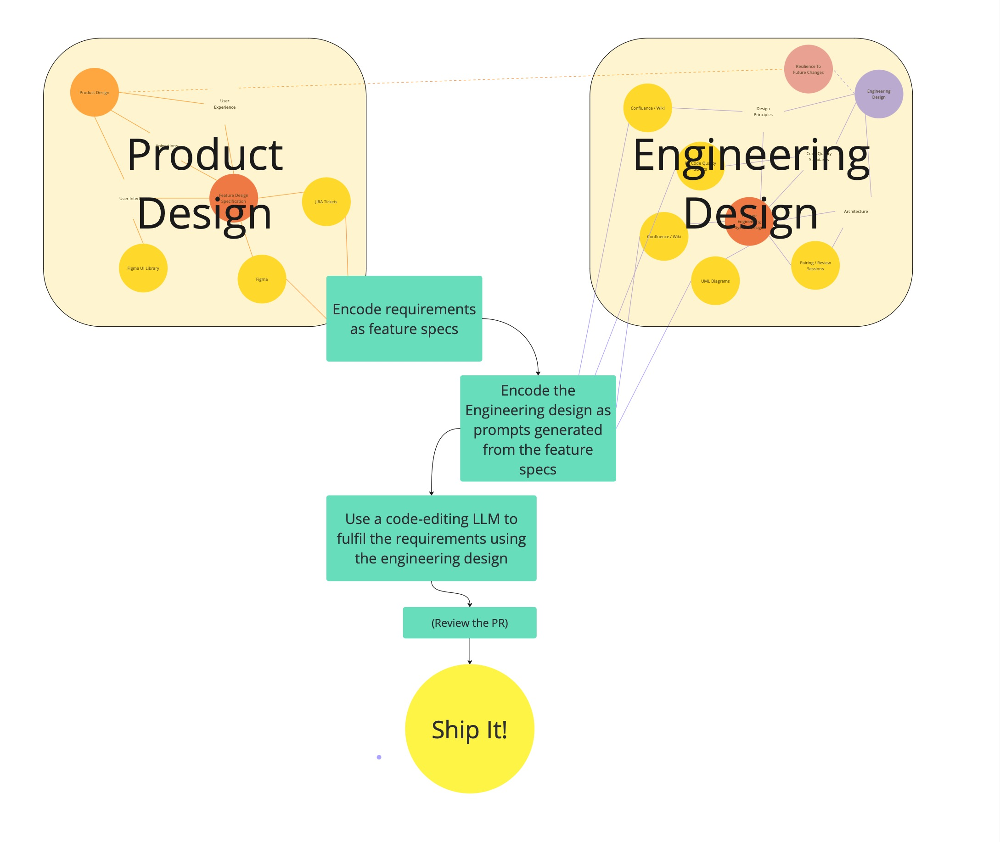

# About

I want to introduce an approach to writing software that uses generative AI tools to iteratively write fully functional native mobile app source code from a set of product requirements.

Using this system, the prompts used by the AI to generate the source code are not written each time by the developer, but are saved in libraries that are pre-configured to code common problems using a particular pattern. For example you might choose to use a library that implements a set of views using the MVVM pattern or you could choose The Composable Architecture (TCA). Using this system the same requirements could be used to generate the underlying structure for either approach. 

This results in a new type of development environment where you write software by taking *feature specifications* encoding a description of your product requirements, and *prompt generators* that encode a chosen approach to how to implement those requirements.

# But Why?

Before diving into how I've started building this sort of a system. I think it's worth expanding a little bit on why I think it's useful.

* Generative AI has unrealised potential
  * Generative AI (gen-AI) for software development has developed rapidly over the past few years. It's changed the way many developers work on the *micro* level of writing code where it's already commonplace to write simple functions using gen-AI assistants. However, for big projects there's currently no way to scale this to the *macro* level and direct a gen-AI toolset to keep iterating and writing code in the way we want it to until a full set of features are fulfilled. The approach proposed here joins these simple tasks together to build a complete set of code from a set of feature requirements. This expands the time-saving potential for gen-AI coding assistants from helping to write individual functions to writing tens or hundreds of files that all work together as a set of source code to fulfil requirements.
* Encoding requirements is already useful
  * One major human 'input' of this approach involves defining a set of requirements to describe how features should behave that is independent of how they are built. Even without a tool to automate writing the software, these encoded descriptions of features are already very useful when working with LLMs. For example they can be used to check that requirements are covered by tests, or in some situations that the code fulfills the requirements.
* We save time by removing repetitive prompt writing.
  * Saving time by removing repetition is a very common aim in software development, it even has it's own acronym [DRY](https://en.wikipedia.org/wiki/Don%27t_repeat_yourself). This system removes the repetition of prompt writing across any number of projects that are a good fit for the tool. Eg, if this tool can be used to write boilerplate MVVM structure for all the views in one product, and then across hundreds of similar products, the time-savings globally will be very impactful.
* Generalising the approach to writing software leads to more familiar and resilient code structures
  * What this approach forces us to do is to define as a set of descriptive prompts *how* to implement requirements as code within a chosen pattern. Essentially this is already what 1000+ blog posts on MVVM or TCA or whatever network architecture you choose already do, and again (privately) what 1000s of teams do with 'coding principles' Wiki-pages. This tool uses these descriptions of how to write code in a way that actually allows you to automate the process of writing code. By encoding the knowledge and experience of many engineers into the system used to write the code, we can systematically improve the code produced, avoiding bugs and pitfalls that have been learnt through experience.
* If I give more responsibility to AI, I want to guide it
  * As software development teams increasingly incorporate gen-AI tools into their workflow, having a structure in place to ensure coding standards are maintained will set your team up for success as this new practice evolves. This research will help position development teams to be ready for that change.